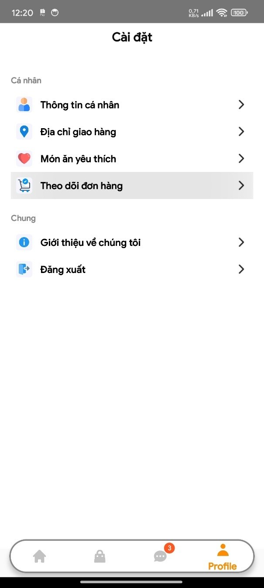

# Ứng Dụng Đặt Đồ Ăn Nhanh OMNIFOOD

## Giới Thiệu

Ứng dụng đặt đồ ăn nhanh OmniFood là một giải pháp toàn diện cho việc đặt và giao đồ ăn trực tuyến. Ứng dụng được phát triển trên nền tảng Android, cung cấp trải nghiệm người dùng mượt mà và tiện lợi.

## Tính Năng Chính

### Giao diện khởi động


### 1. Xác Thực Người Dùng


- Đăng nhập với email và mật khẩu
- Đăng nhập với tài khoản Google
- Đăng ký tài khoản mới
- Quản lý thông tin cá nhân
- Đổi mật khẩu

### 2. Khám Phá Món Ăn


- Xem danh sách món ăn theo danh mục
- Tìm kiếm món ăn
- Xem chi tiết món ăn (hình ảnh, giá, mô tả)
- Lọc món ăn theo giá, danh mục

### 3. Giỏ Hàng


- Thêm/xóa món ăn vào giỏ hàng
- Điều chỉnh số lượng
- Chọn địa chỉ giao hàng
- Áp dụng mã giảm giá
- Xem tổng tiền
- Lưu giỏ hàng

### 4. Đặt Hàng


- Chọn phương thức thanh toán
- Xác nhận đơn hàng

### 5. Thanh Toán Online


- Tích hợp cổng thanh toán VNPay
- Thanh toán an toàn và bảo mật
- Xác nhận giao dịch
- Lưu lịch sử thanh toán

### 6. Quản Lý Đơn Hàng


- Theo dõi trạng thái đơn hàng
- Xem lịch sử đơn hàng
- Hủy đơn hàng
- Đánh giá đơn hàng

### 7. Quản Lý Tài Khoản





- Cập nhật thông tin cá nhân
- Quản lý địa chỉ giao hàng
- Cài đặt thông báo

## Công Nghệ Sử Dụng

- Android Studio
- Java
- MVVM Architecture (Model - View - View Model)
- Retrofit2 cho API calls
- Material Design Components
- Glide cho xử lý hình ảnh
- Google service cho Google Map và Firebase Cloud Messaging

## Yêu Cầu Hệ Thống

- Android 7.0 (API level 24) trở lên
- Kết nối internet
- GPS cho tính năng định vị

## Cài Đặt

1. Clone repository:

```bash
git clone https://github.com/raichuvn11/UIAppFastFood
```

2. Mở project trong Android Studio

3. Sync Gradle và build project

4. Chạy ứng dụng trên thiết bị hoặc máy ảo

## Đóng Góp

Mọi đóng góp đều được hoan nghênh. Vui lòng tạo pull request hoặc issue để đóng góp.

## Giấy Phép

Dự án này được phát hành dưới giấy phép [Custom Non-Commercial License](LICENSE) (Dựa trên GNU GPL v3). Điều này có nghĩa là:

- Bạn có thể tự do sử dụng, nghiên cứu, chia sẻ và sửa đổi mã nguồn cho mục đích phi thương mại
- Bạn có thể phân phối lại dự án với điều kiện kèm theo mã nguồn
- Bạn phải giữ nguyên thông báo bản quyền và giấy phép
- Bạn KHÔNG được phép sử dụng dự án cho mục đích thương mại

Để sử dụng dự án cho mục đích thương mại, vui lòng liên hệ với tác giả để được cấp giấy phép thương mại riêng.

Xem file `LICENSE` để biết thêm chi tiết về các điều khoản và điều kiện.

## Liên Hệ

- Email: [manhtu.cutu@gmail.com] or [hdphat123@gmail.com]
